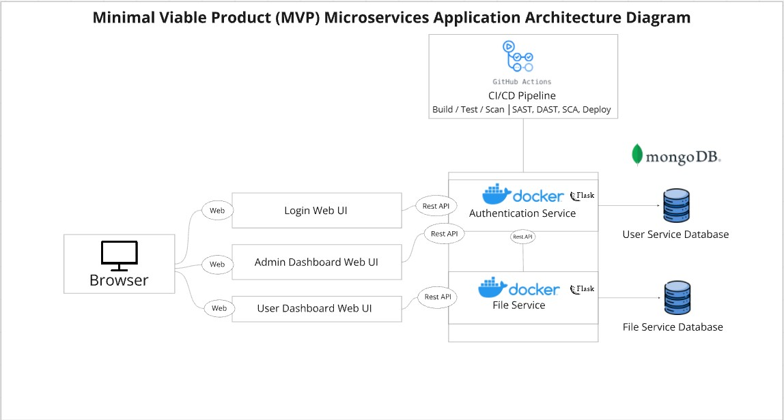
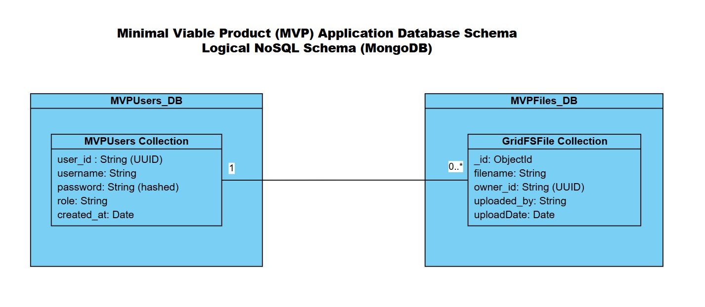

# DevOps_Oct2025_Team3_T03_Assignment
<!-- Steps to run app.py:
1. Install the required dependencies 
- pip install -r authService/requirements.txt
- pip install -r fileService/requirements.txt
2. Open two terminal, each terminal type in:
- python -m fileService.app
- python -m authService.app
3. Launch index.html via Live servera -->

# We!earn — Classroom Learning Management System (MVP)

## Overview

**We!earn** is a minimal viable product (MVP) designed to demonstrate **DevSecOps practices** while providing a simple **educational platform**. The system allows:

- Users (students and teachers) to log in and access dashboards.  
- Teachers to upload lecture materials.  
- Students to upload assignments.  
- Admins to manage users.  

The MVP implements a **microservices architecture** with DevSecOps principles integrated into the CI/CD pipeline.

---

## Features

### Functionalities

- **User Authentication & Authorization**
  - Admin, Teacher, Student roles
  - Session-based authentication
- **File Management**
  - Students upload assignments
  - Teachers upload lecture materials
  - Files stored in MongoDB using GridFS
- **Dashboards**
  - Admin: user management
  - Teacher: class overview, file upload
  - Student: progress tracking, assignments
- **DevSecOps**
  - CI/CD via GitHub Actions
  - SAST, SCA, DAST scanning
  - Automated testing and notifications

---

## Architecture Diagram



- **Frontend**
  - HTML/CSS/JS pages for login, admin, teacher, and student dashboards  
- **Backend Services**
  - **Auth Service** (`Flask`) — user login, admin management  
  - **File Service** (`Flask`) — file upload/download using GridFS  
  - Each service runs in its own **Docker container**
- **Database**
  - **MVPUsers_DB** — stores users and roles  
  - **MVPFiles_DB** — stores files using GridFS
- **CI/CD Pipeline**
  - GitHub Actions
  - Automatic build, test, security scanning, and deployment

---

## Database Schema
 

### MVPUsers_DB

| Field       | Type   | Description                |
|------------|--------|---------------------------|
| user_id    | String | Unique UUID for each user |
| username   | String | User login name           |
| password   | String | Hashed with bcrypt        |
| role       | String | admin / student / teacher |
| created_at | Date   | Account creation timestamp |

### MVPFiles_DB (GridFS)

| Field       | Type     | Description                    |
|------------|---------|--------------------------------|
| _id        | ObjectId | GridFS file ID                |
| filename   | String   | Original file name            |
| owner_id   | String   | References `MVPUsers.user_id` |
| uploaded_by| String   | Username of uploader          |
| uploadDate | Date     | Timestamp of upload           |


**Relationship:**  
- One user can own multiple files (1-to-many).  
- Ownership enforced in backend using `owner_id`.

---

## Setup Instructions

### Prerequisites

- Python 3.11 or above
- MongoDB Atlas cluster  
- Docker & Docker Compose  

### Running Locally

1. Clone repository:
```bash
git clone <repo-url>
```

2. Install dependencies:
```bash
pip install -r backend/authService/requirements.txt
pip install -r backend/fileService/requirements.txt
```

3. Run backend services (Flask):
```bash
cd backend
python -m authService.app
python -m fileService.app
```

4. Open `index.html` with VSCode Live Server in browser and log in as the default admin to view current users and create users:
```
username: admin
password: AdminPass123!
```

---

## DevSecOps Practices

- **Static Application Security Testing (SAST)**: Scans source code for common vulnerabilities.  
- **Software Component Analysis (SCA)**: Checks dependencies for known CVEs.  
- **Dynamic Analysis (DAST)**: OWASP ZAP scans running services.  
- **CI/CD Pipeline**: Automates build, test, and security scans; sends notifications on failures.

---

## Notes
- Session-based authentication secures all API endpoints.  
- File uploads stored securely in GridFS.  
- Admin users manage user roles and monitor system activity.
